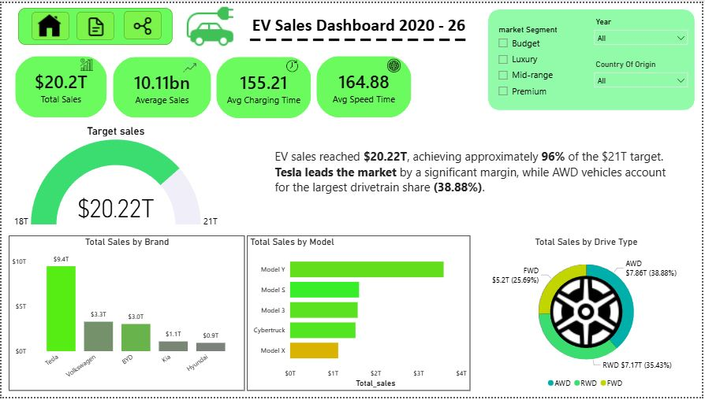

# 🚗 EV Sales Dashboard (2020–2026) | Power BI

## 📌 Project Overview

The **EV Sales Dashboard (2020–2026)** is an end-to-end Business Intelligence project built using **Microsoft Power BI**. The dashboard provides an interactive analysis of the global Electric Vehicle (EV) market, helping users understand sales performance, market trends, brand performance, vehicle specifications, and customer preferences.

This project demonstrates the complete BI workflow—from raw data preparation and transformation to interactive dashboard development and business insight generation.

---

## 🎯 Project Objectives

- Analyze EV sales trends from 2020 to 2026.
- Compare leading EV brands and vehicle models.
- Evaluate market segments and regional sales performance.
- Analyze vehicle specifications such as horsepower, range, torque, and acceleration.
- Provide interactive business insights through dynamic visualizations.

---

# 📂 Repository Structure

```
EV-Sales-Dashboard/
│
├── Dashboard.pbix
├── End to End Documentation.docx
├── Market Analysis.JPG
├── Overview.JPG
├── Performance Analysis.JPG
├── README.md
├── ev_market_2026 dashboard.csv
└── ev_market_2026_Raw data.csv
```

---

# 📊 Dashboard Pages

## 1️⃣ Executive Overview



### Highlights

- Total Sales KPI
- Average Sales
- Average Charging Time
- Average Speed
- Sales Target Gauge
- Brand-wise Sales
- Model-wise Sales
- Drive Type Distribution
- Dynamic Business Insights

### Key Insights

- Total EV Sales reached **$20.22T**, achieving approximately **96%** of the $21T sales target.
- Tesla is the market leader in total sales.
- Model Y is the highest-selling vehicle model.
- AWD vehicles account for the largest drivetrain share.

---

## 2️⃣ Market Analysis


### Highlights

- Sales by Year
- Sales by Market Segment
- Sales by Brand
- Country-wise Sales
- Model Variant Distribution
- Brand Treemap
- Interactive Filters

### Key Insights

- Luxury vehicles generate the highest overall sales.
- Sales experienced significant growth between 2023 and 2025.
- The United States contributes the highest EV sales among all countries.
- Tesla dominates the global EV market.

---

## 3️⃣ Performance Analysis


### Highlights

- Average Acceleration
- Average Horsepower
- Average Driving Range
- Average Torque
- Sales by Warranty Years
- Sales by Autopilot Level
- Market Segment Performance

### Key Insights

- Premium vehicles hold the largest market share.
- Vehicles with **5-year warranties** generate the highest sales.
- Autopilot Level 2 is the most common configuration.
- Average vehicle performance:
  - ⚡ 5.63 Seconds Acceleration
  - 🐎 665.7 HP Horsepower
  - 🚗 261.8 Miles Driving Range
  - 🔩 601.3 Nm Torque

---

# 📈 KPIs Used

- Total Sales
- Average Sales
- Average Charging Time
- Average Speed
- Average Acceleration
- Average Horsepower
- Average Range
- Average Torque

---

# 📊 Visualizations Used

- KPI Cards
- Gauge Chart
- Donut Chart
- Bar Chart
- Column Chart
- Funnel Chart
- Treemap
- Slicers
- Dynamic Text Cards

---

# 🛠 Tools & Technologies

- Microsoft Power BI
- Power Query
- DAX
- Data Modeling
- Data Cleaning
- Data Visualization
- Interactive Reporting

---

# 📁 Files Included

| File | Description |
|------|-------------|
| Dashboard.pbix | Power BI dashboard file |
| End to End Documentation.docx | Complete project documentation |
| Overview.JPG | Executive Overview dashboard screenshot |
| Market Analysis.JPG | Market Analysis dashboard screenshot |
| Performance Analysis.JPG | Performance Analysis dashboard screenshot |
| ev_market_2026 dashboard.csv | Processed dataset used in Power BI |
| ev_market_2026_Raw data.csv | Original raw dataset |
| README.md | Project documentation |

---

# 🚀 Project Workflow

1. Data Collection
2. Data Cleaning using Power Query
3. Data Transformation
4. Data Modeling
5. DAX Measure Creation
6. Dashboard Design
7. Business Insight Generation
8. Interactive Reporting

---

# 💡 Business Insights

- Tesla leads the EV market with the highest sales.
- Luxury and Premium vehicle segments contribute the largest revenue.
- EV sales show a strong upward trend from 2020 to 2025.
- The United States is the leading market for EV sales.
- Longer warranty periods positively correlate with higher sales.
- Vehicle performance metrics such as horsepower and driving range are strongest among premium models.

---

# 🎯 Skills Demonstrated

- Data Cleaning
- Data Transformation
- Data Modeling
- DAX Calculations
- Power Query
- Dashboard Design
- Business Intelligence
- Data Visualization
- Analytical Thinking
- Storytelling with Data

---

# 📸 Dashboard Preview

### Executive Overview


---

### Market Analysis


---

### Performance Analysis


---

# ⭐ If you found this project useful, please consider giving it a star!

Feedback and suggestions are always welcome.
